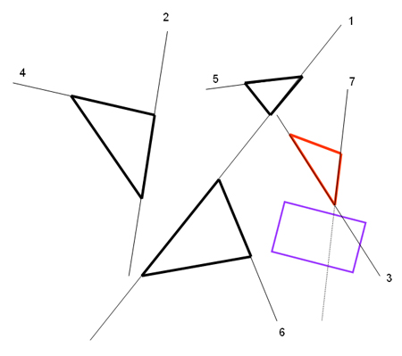
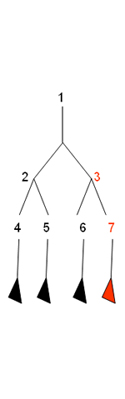
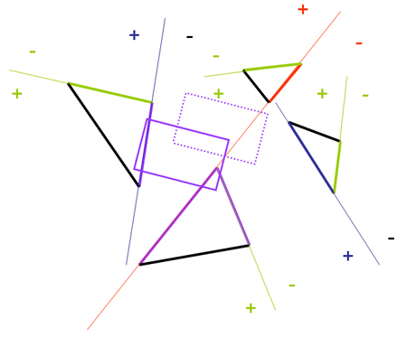

# Oriented Bounding Box (OBB) Collision Detection with BSP

The concept of BSP can be extended to the application for the collision detection between dynamics objects and a huge static scene (it can be dynamics if the tree is keeping updated in real-time, but it is costly to do so).  In this work, I tried to implement this idea.

Actually, the shape of the OBB of a dynamics object is similar to a viewing frustum (both are a convex primitive).  It can similarly traverse the tree and check for collision with every node going through, so that many polygons which are far away from that OBB can be ignored in collision detection and thus it saves plenty of CPU costs for the other aspects, such as AI and animation, in some real-time applications.  In figure 1.1, the rectangle in purple on the left is the OBB of a dynamics object.  On right, that is the tree of the scene.  The OBB is intersecting with the partitioning plane in node "3", so the node's face of "3" is checked.  As the OBB is across both sides of node "3", planes in node "6" and node "7" have to be considered.  Because the OBB doesn't intersect with plane "6", it lessens the scope to merely considering plane "7" now.  As node "7" is a leaf, the triangles belonging to it are checked.  Therefore, instead of checking all these 12 faces, by applying BSP concept, it can be significantly reduced to 3 faces.

*Figure 1.1*

<p align="center">
	
	
  	<br>
</p>

Below is the code fragment for collision detection between an OBB and a BSP tree.  "pOBB" is a pointer to the OBB and "pNode" is a pointer to the root of the tree.

```cpp
//Recursive function for checking collision between OBB and BSP tree.

bool IsCollided(OBB *pOBB, BSP_Node *pNode)
{
	//If this is leaf node, directly check all triangles in this leaf.
	if(pNode->IsLeaf)
	{

		int i;
		Triangle tri;

		tri.v[0] = pNode->v[0];
		tri.v[1] = pNode->v[1];
		tri.v[2] = pNode->v[2];

		tri.n.x = pNode->normal.x;
		tri.n.y = pNode->normal.y;
		tri.n.z = pNode->normal.z;

		//Check for node's triangle.
		if(CheckCollision(&tri, pOBB))
			return true;

		//Check for threshold triangle(s).
		for(i = 0; i < pNode->numTriangles; i++)
		{

			if(CheckCollision(&pNode->tri[i], pOBB))
				return true;

		}

		//Check for coplanar triangle(s).
		for(i = 0; i < pNode->numConTri; i++)
		{
			if(CheckCollision(&pNode->pCoplanarTriangle[i], pOBB))
				return true;
		}

		return false;
	}

	//This is not leaf node, so tranverse BSP tree.
	//Check for 8 vertices of OBB.
	float w[8], var;

	var = pNode->v[0].x * pNode->normal.x + pNode->v[0].y * pNode->normal.y + pNode->v[0].z * pNode->normal.z;
	w[0] = (pOBB->v[0] * pNode->normal) - var;
	w[1] = (pOBB->v[1] * pNode->normal) - var;
	w[2] = (pOBB->v[2] * pNode->normal) - var;
	w[3] = (pOBB->v[3] * pNode->normal) - var;
	w[4] = (pOBB->v[4] * pNode->normal) - var;
	w[5] = (pOBB->v[5] * pNode->normal) - var;
	w[6] = (pOBB->v[6] * pNode->normal) - var;
	w[7] = (pOBB->v[7] * pNode->normal) - var;

	//If OBB is located at positive side, check all nodes in positive side.
	if(w[0] >= 0.0f && w[1] >= 0.0f && w[2] >= 0.0f && w[3] >= 0.0f && w[4] >= 0.0f && w[5] >= 0.0f && w[6] >= 0.0f && w[7] >= 0.0f)
	{
		if(pNode->Pos_Child != NULL)
		{
			if(IsCollided(pOBB, pNode->Pos_Child))
				return true;
		}
		else
			return false;
	}
	else
	{

		//If OBB is located at negative side, check all nodes in negative side.
		if(w[0] < 0.0f && w[1] < 0.0f && w[2] < 0.0f && w[3] < 0.0f && w[4] < 0.0f && w[5] < 0.0f && w[6] < 0.0f && w[7] < 0.0f)
		{
			if(pNode->Neg_Child != NULL)
			{
				if(IsCollided(pOBB, pNode->Neg_Child))
					return true;
			}
			else
				return false;
		}
		else
		{
			//OBB is intersecting with node's plane, so check for collision between node's triangle and OBB.
			int i;
			Triangle tri;

			tri.v[0] = pNode->v[0];
			tri.v[1] = pNode->v[1];
			tri.v[2] = pNode->v[2];

			tri.n.x = pNode->normal.x;
			tri.n.y = pNode->normal.y;
			tri.n.z = pNode->normal.z;

			//Check for node's triangle.
			if(CheckCollision(&tri, pOBB))
				return true;

			//Check for threshold triangle(s).
			for(i = 0; i < pNode->numTriangles; i++)
			{
				if(CheckCollision(&pNode->tri[i], pOBB))
					return true;
			}

			//Check for coplanar triangle(s).
			for(i = 0; i < pNode->numConTri; i++)
			{
				if(CheckCollision(&pNode->pCoplanarTriangle[i], pOBB))
					return true;
			}		

			//No collision between OBB and node's triangle(s), so check for all nodes in positive side.
			if(pNode->Pos_Child != NULL)
			{
				if(IsCollided(pOBB, pNode->Pos_Child))
					return true;
			}

			//Still no collision, thus check for all nodes in negative side.
			if(pNode->Neg_Child != NULL)
			{
				if(IsCollided(pOBB, pNode->Neg_Child))
					return true;
			}

		}

	}

	return false;
}

```

The collision detection between an OBB and a triangle can be handled by projection test using Separating Axis Principle (SAP).  For this configuration, there are four normal vectors, one from the triangle (N_TRI) and three from the OBB (N1_OBB, N2_OBB and N3_OBB).  According to SAP, in choosing the projection directions, these should be that four normal vectors and their cross products.  Without redundancy, there are 7 directions for the projection test: N_TRI, N1_OBB, N2_OBB, N3_OBB, N_TRI x N1_OBB, N_TRI x N2_OBB and N_TRI x N3_OBB.  Here is the code fragment for the test:

```cpp
bool CheckCollision(Triangle *pTri, OBB *pOBB) {
    int index;
    float pValTri[3], pValOBB[8];
    float MaxOBB, MinOBB, MaxTri, MinTri;

    // Projection axis: normal 1 of OBB
    CalculateProject(pTri, pOBB->Nx, pValTri);
    MaxProjVal(3, pValTri, &index, &MaxTri);
    MinProjVal(3, pValTri, &index, &MinTri);
    CalculateProjection(pOBB, pOBB->Nx, pValOBB);
    MaxProjVal(8, pValOBB, &index, &MaxOBB);
    MinProjVal(8, pValOBB, &index, &MinOBB);
    if (MaxTri < MinOBB || MinTri > MaxOBB) return false;

    // Projection axis: normal 2 of OBB
    CalculateProject(pTri, pOBB->Ny, pValTri);
    MaxProjVal(3, pValTri, &index, &MaxTri);
    MinProjVal(3, pValTri, &index, &MinTri);
    CalculateProjection(pOBB, pOBB->Ny, pValOBB);
    MaxProjVal(8, pValOBB, &index, &MaxOBB);
    MinProjVal(8, pValOBB, &index, &MinOBB);
    if (MaxTri < MinOBB || MinTri > MaxOBB) return false;

    // Projection axis: normal 3 of OBB
    CalculateProject(pTri, pOBB->Nz, pValTri);
    MaxProjVal(3, pValTri, &index, &MaxTri);
    MinProjVal(3, pValTri, &index, &MinTri);
    CalculateProjection(pOBB, pOBB->Nz, pValOBB);
    MaxProjVal(8, pValOBB, &index, &MaxOBB);
    MinProjVal(8, pValOBB, &index, &MinOBB);
    if (MaxTri < MinOBB || MinTri > MaxOBB) return false;

    // Projection axis: triangle's normal of OBB
    CalculateProject(pTri, pTri->n, pValTri);
    MaxProjVal(3, pValTri, &index, &MaxTri);
    MinProjVal(3, pValTri, &index, &MinTri);
    CalculateProjection(pOBB, pTri->n, pValOBB);
    MaxProjVal(8, pValOBB, &index, &MaxOBB);
    MinProjVal(8, pValOBB, &index, &MinOBB);
    if (MaxTri < MinOBB || MinTri > MaxOBB) return false;

    // Projection axis: cross product of triangle's normal and normal 1 of OBB
    CalculateProject(pTri, CrossProduct((*pTri).n, pOBB->Nx), pValTri);
    MaxProjVal(3, pValTri, &index, &MaxTri);
    MinProjVal(3, pValTri, &index, &MinTri);
    CalculateProjection(pOBB, CrossProduct((*pTri).n, pOBB->Nx), pValOBB);
    MaxProjVal(8, pValOBB, &index, &MaxOBB);
    MinProjVal(8, pValOBB, &index, &MinOBB);
    if (MaxTri < MinOBB || MinTri > MaxOBB) return false;

    return true; // No separating axis found, thus collision occurs.
}
```

To prevent the OBB getting locked inside the obstacle, for each advancing loop of it, there is a copy of its previous state valuables (displacement, velocity and momentum etc).  When the collision occurs, its current state valuables will be restored to the previous one, so as to ensure that the OBB will never go inside the obstacle.  This simple idea is shown in figure 1.2, the rectangle in purple is the OBB of a dynamics object at a certain instant and will be restored to the dotted previous one.

*Figure 1.2*

<p align="center">
		
  	<br>
</p>